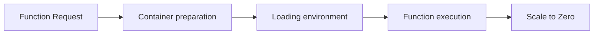

# Optmizing ML models using threads, CPickle and reducing the tail at scale network

## What is tail at Scale network?

When you split your feature in multiple services, you need take care of a way to connect them. Usually this is made by a network call. This can be done by a File Transfer, Shared Database, Remote procedure call or even messaging. [1]

Recently, serverless become a new way to build applications, you have multiple, tiny functions that are triggered by events. Basically a micro-micro service architecture. But when a provider sell this solution to you, they don't tell you that you have problems to solve. One of them is the tail at scale network.

The tail at scale network is a problem that happens when you have a lot of deploys and are using one of the approach mentioned above to connect them. The problem is that the network latency can be very high and introduce a lot of problems in your application. [2]

This can appear clearly in the _cold start latency_, introduced by the serverless architecture. You don't have machines to take care of, but each call in your function it's a new "machine" that needs to be started. [3]

The cold start latency can be defined by the figure below:

In serverless computing, each function is assigned to a separate container for the execution of functions. If the container is ready, the function is directly assigned to this container, and the function is executed. However, if there is no ready container, which is mostly the case, it is necessary to prepare a new container to execute the function. In the serverless paradigm, containers are
released after a specific time (𝜏) after executing functions to avoid wasting resources. This process is known as the scale to zero. After the containers are scaled to zero, it is necessary to start the container again for the requests coming to the server. Starting a new container and preparing the
function for execution causes a **specific latency** [3].

# References

- [Enterprise Integration Patterns - Designing, Building, and Deploying Messaging Solutions][1]
- [The tail at Scale][2]
- [Cold Start Latency in Serverless Computing: A Systematic Review, Taxonomy, and Future Directions
][3]

[1]: https://www.oreilly.com/library/view/enterprise-integration-patterns/0321200683/
[2]: https://www.barroso.org/publications/TheTailAtScale.pdf
[3]: https://arxiv.org/abs/2310.08437
