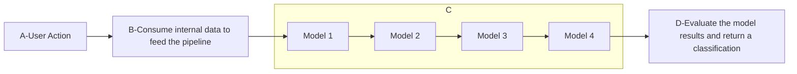
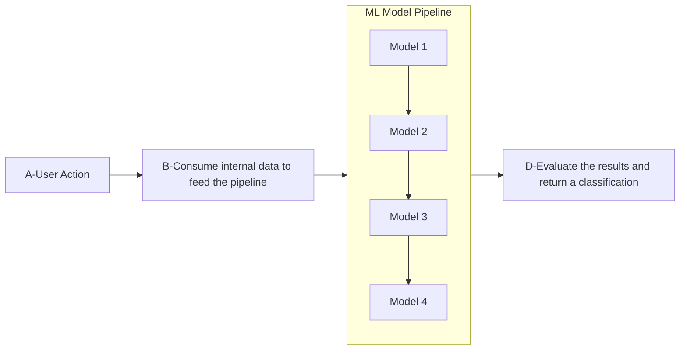

Most of the systems should have a predictable response time, this to attend the user expectations, follow a SLA and to make everything smooth. But sometimes, we have some problems to achive it. This article will show how serverless can introduce a problem in your ML pipeline and how I solved it.

## What is tail at Scale network?


When you split your feature in multiple services, you need take care of a way to connect them. Usually this is made by a network call. This can be done by a File Transfer, Shared Database, Remote procedure call or even messaging. [1]

Recently, serverless become a new way to build applications, you have multiple, tiny functions that are triggered by events. Basically a micro-micro service architecture. But when a provider sell this solution to you, they don't tell you that you have problems to solve. One of them is the tail at scale network.

The tail at scale network is a problem that happens when you have a lot of deploys and are using one of the approach mentioned above to connect them. The problem is that the network latency can be very high and introduce a lot of problems in your application. [2]

This can appear clearly in the _cold start latency_, introduced by the serverless architecture. You don't have machines to take care of, but each call in your function it's a new "machine" that needs to be started. [3]

The cold start latency can be defined by the figure below:


In serverless computing, each function is assigned to a separate container for the execution of functions. If the container is ready, the function is directly assigned to this container, and the function is executed. However, if there is no ready container, which is mostly the case, it is necessary to prepare a new container to execute the function. In the serverless paradigm, containers are
released after a specific time (𝜏) after executing functions to avoid wasting resources. This process is known as the **scale to zero**. After the containers are scaled to zero, it is necessary to start the container again for the requests coming to the server. Starting a new container and preparing the
function for execution causes a **specific latency** [3].

# Ok. But how this fit in the real world?

I was developing a ML pipeline responsible for classifying a user action. This pipeline is compose by multiples serverless functions, each one responsible for a step in the pipeline. Like the figure below:



The step `C` was unintentionally the bottleneck of the pipeline. In my first implementation, I was creating a different deploy for each model, and connecting the output of each model to the input of the next one using Queues(network calls). But as I said before, the network latency can be unpredictable, and in my case I was using serverless functions with zero-scale, so the time to load the pickle file and made the prediction was affecting the time constraint of the pipeline, **5 seconds** from the root to the leaf of the flow.

Here is a table with the processing latencies in milliseconds for each model.
This table represents the 50th, 90th, and 95th percentiles for the processing latencies.

| Module Name                   | 50th Percentile (Median) | 90th Percentile | 95th Percentile |
|-------------------------------|--------------------------|-----------------|-----------------|
| ENSEMBLE_TYPE_II_WITH_SAMPLE   | 2743.0                   | 3524.5          | 3574.55         |
| LOGISTIC_TYPE_1_MODEL          | 7352.0                   | 10893.8         | 11041.15        |
| LOGISTIC_TYPE_II_NO_SAMPLE     | 5088.5                   | 7982.1          | 8390.85         |
| LOGISTIC_TYPE_II_WITH_SAMPLE   | 6477.5                   | 8506.8          | 9055.4          |


- The sum of the mean of the **total model processing** was 21.6s
- The sum 90th percentile of the **total model processing** was 30.90s
- The sum 95th percentile of the **total model processing** was 32.0s

Not to hard to see that just the time to run the models is more than my constraint of 5 seconds. So I needed to find a way to reduce this time.

But before start to create a solution, I needed to instrument the code to understand where the time was being spent. I used the `time` module to measure the time spent in each step of the pipeline. The results are below:


What is possible to see in the images above is that the time spent to load the pickle file was the bottleneck of the pipeline, but we just pay the biggest time in the first call of the function. The next calls are faster because the container is already loaded and the pickle file is in memory.

Based on this information, I decided to load all the models using **ThreadPool** and do all of that in the same container. Using this approach, I was able to reduce the time spent to load the pickle file and make the prediction. The results are below:

Here is the markdown table with the provided data for `LOGISTIC_TYPE_1_MODEL`:

| Module Name            | 50th Percentile (Median) | 90th Percentile | 95th Percentile |
|------------------------|--------------------------|-----------------|-----------------|
| ALL_MODELS   | 270.0                    | 8475.0          | 10332.75        |

This table reflects the 50th, 90th, and 95th percentiles for the `LOGISTIC_TYPE_1_MODEL`.

The reduction of time was aggressive.

- The mean of the **total model processing** was 270ms
- The 90th percentile of the **total model processing** was 8.475s
- The 95th percentile of the **total model processing** was 10.332s

The pipeline after the change was like the figure below:



To load all models in single shot, I used the `ThreadPoolExecutor` module from Python. The code is below:

```python
def load_all_models(self) -> dict:
        """
        Load all models from the file system and return a dictionary with the model name as the key and the model itself
        """
        # Dictionary to store all models. Using the model name as the key and the model itself as the value.
        models = {}
        start_time = time.perf_counter()
        with ThreadPoolExecutor() as executor:
            results = list(executor.map(load_pickle_model, file_names))
            # Assign each model to a dictionary with the model name as the key and the model itself as the value
            for file_path, model in zip(file_names, results):
                models[file_path] = model
        end_time = time.perf_counter()

        elapsed_time = end_time - start_time
        self.logging.info(
            {
                "message": f"Time to load all models: {elapsed_time:0.8f} seconds",
            }
        )
        return models
```

Accordingly the [documentation](https://superfastpython.com/threadpool-python/#Step_2_Submit_Tasks_to_the_Thread_Pool) the threadpool is perfect for I/O bound tasks, and the pickle file load is a I/O bound task. Besides that, using the Executor map functions, it's possible to load all models and lock the main thread until all models are loaded, avoiding deadlocks.

## Wake up

To not increase your cost and keep using the zero-scale approach and also maintaning the time to load the differents containers controlled, a good approach is to use a warm-up strategy. This strategy is basically call all the healthcheck endpoints of each service in your pipeline. This will make the following containers be warmed up before the first call, reducing the overall time spent in the pipeline.

# References

- [Enterprise Integration Patterns - Designing, Building, and Deploying Messaging Solutions][1]
- [The tail at Scale][2]
- [Cold Start Latency in Serverless Computing: A Systematic Review, Taxonomy, and Future Directions
][3]


[1]: https://www.oreilly.com/library/view/enterprise-integration-patterns/0321200683/
[2]: https://www.barroso.org/publications/TheTailAtScale.pdf
[3]: https://arxiv.org/abs/2310.08437
