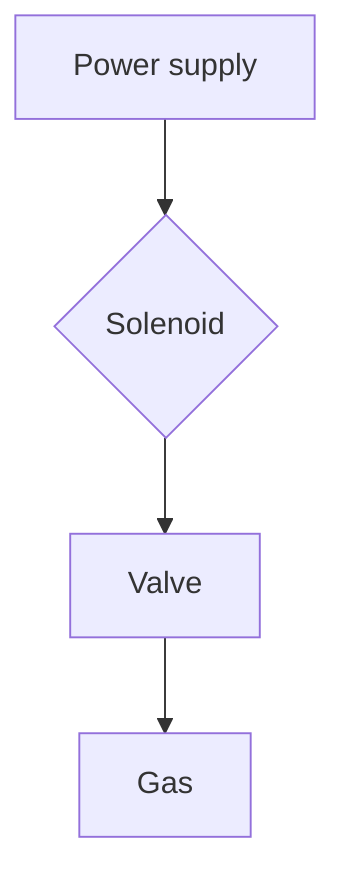

    

# Topus - EESC USP

Topus is a engineering group focused on aerospace engineering. The group is composed by students from the University of São Paulo, Brazil, focused on the development of rockets and other aerospace components.

The goal of the group is to participate of some competitions and develop an engineering culture among the students of different courses, like mechanical engineering, electrical engineering, computer science, aerospace engineering and others.

# Felling stupid, really stupid

In the computer engineering course. I had contact with software development, eletronics and eletrical engineering, is everything at once. But, I perceived that I put way more effort in the software development than the other areas. So, I decided to learn a little bit more about the eletronics and eletrical engineering. For this reason, I decided to join the Topus group.

And was here that my frustration started. My first task was to design a solenoid system. And you can imagine that put it on a rocket, that will take off, is not a easy task, that are a LOT of consideration to take care.

This system can be described as follow:

<!-- During my engineering course between 2018-2023, I basically dedicated my time on the scientific initiation and other group of studies that share knowledge about software development, open source and advanced topics in computer science, and the other half of my time I dedicated working.

Maybe I have some regrets about not dedicate my time in different activities, like different group of studies. But now I have my change. -->

# Solenoid system
