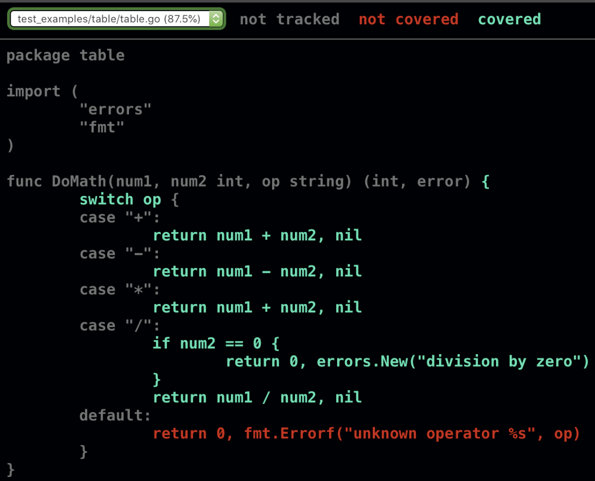

# What the Go team got right?

For the Gophers out there, after getting in touch with some projects and the language itself, it's easy to see that some details about the language turns your life much easier. One of these details is the testing package and all the tooling around it. Like the `go test`, `go test -cover`, `go test -bench`, `go test -race`, build tags, and so on.

Everything is in the same box, you don't need to install of configure nothing, just play around your code and start to ship 🚀.

This post will cover the basic of testing, **the minumum you need to know.**

## Report test failure

* every test is written in a file whose name ends with **_test.go**
* When writing a unit test, for individual functions, the convetion is to name the test function as **TestFunctionName**
* The **(t *testing.T) argument** is used across all tests and bring with it multiple useful functions to report test failures.


**Example**

```go
type Random struct {
    description string
}

func (j *Random) Describe() string {
    j.description = "Adding a description"
}

// Is this the Right way to name a test function?
func TestDescribe(t *testing.T) {
    j := Random{}
    j.Describe()
    if j.description != "Adding a description" {
        t.Errorf("Expected 'Adding a description', got %s", j.description)
    }
}

// Or this way?
func TestRandom_Describe(t *testing.T) {
    j := Random{}
    j.Describe()
    if j.description != "Jojo is a" {
        t.Errorf("Expected 'Jojo is a', got %s", j.description)
    }
}

func TestRandom_Describe_WrongValidation(t *testing.T) {
    j := Random{}
    j.Describe()
    if j.description != "Jojo is a" {
        t.Errorf("Expected 'Jojo is a', got %s", j.description)
    }
}

func TestRandom_Describe(t *testing.T) {
    t.Run("Adding a description", func(t *testing.T) {
        j := Random{}
        j.Describe()
        if j.description != "Adding a description" {
            t.Errorf("Expected 'Adding a description', got %s", j.description)
        }
    })

    t.Run("Wrong validation"), func(t *testing.T) {
        j := Random{}
        j.Describe()
        if j.description != "Jojo is a" {
            t.Errorf("Expected 'Jojo is a', got %s", j.description)
        }
    }
}
```

## What is the go way?

<div style="display: flex; justify-content: center;">
   
</div>

The rule of gold for every type of application **is to keep some level of consistency**. But the Go team has a specific way to name tests, and following some conventions can make your life easier when you need to find a test or when you need to run a specific test.

We basically can follow the below rules:

- `Test<StructName>_MethodName`
- `Test<StructName>_MethodName_<Exception>`
    - Or use `t.Run` method to create subtests

<div style="display: flex; justify-content: center;">
   
</div>

When we are not testing methods of a struct, we can a simpler approach:

```go
func FunctionName(t *testing.T) {
    // implementation
}

func TestFunctionName(t *testing.T) {
    // implementation
}
```

### How to run?

The below command have two options to run the tests. The first one, run all tests for all packages. The second is **useful when you want to run a specific test**, good for huge codebases, when you don't want to wait for all tests to validate your changes.

```bash
## run all tests. Usage `make test` or `make test testcase="TestFunctionName"` to run an isolated tests
.PHONY: test
test:
	if [ -n "$(testcase)" ]; then \
		go test ./... -timeout 10s -race -run="^$(testcase)$$" -v; \
	else \
		go test ./... -timeout 10s -race; \
	fi
```

### Compare results

The `t.Errorf/t.Error` is used to report a test failure, but you can use `t.Fail` to stop the test execution when something goes wrong(this will trigger a panic and block the whole process).

When we are comparing complex types, like slices, maps, structs, we can use libraries like [`cmp`](https://pkg.go.dev/cmp) or [`require`](https://pkg.go.dev/github.com/stretchr/testify/require) to make the comparison easier.

With them you have more detailed logs without thinking about how to structure it on your own.

# Setting up and tearing down

Those functions are used to initialize and finalize whatever you need to run your tests. Like when you need to run a function after each test to cleanup the database and make sure that the next test will run without any side effect.

### TestMain

`TestMain` is invoked once, not before and after each induvidual test and you can have onlu one per package.

There are two common cases to use `TestMain`:

- When you need to set up data in an external repository, like a database.
- When the code being tested depends on package-level variables that need to be initialized

### Cleanup

The `Cleanup` method is used to clean up temporary resources created for a single test. This method has a single parameters, a functions with no input parameters or return values.

Like `defer`, this method is called after the test has completed, regardless of whether the test passed or failed.

```go
func createFile(t *testing.T) (string, error) {
    t.Helper()
    f, err := os.Create("tempFile")
    if err != nil {
        return "", err
    }
    t.Cleanup(func() {
        os.Remove(f.Name())
    })

    return f.Name(), nil
}

func TestFileProcessing(t *testing.T) {
    fName, err := createFile(t)
    if err != nil {
        t.Fatal(err)
    }
    // do testing, don't worry about cleanup
}
```

# Storing Sample test data

> "If you want to use sample data to test functions in a package, create a **subdirectory named testdata** to hold your files. Go reserves this directory name as a place to hold test files. When reading from testdata, always use a relative file reference. Since go test changes the current working directory to the current package, each package accesses its own testdata via a relative file path.”
>
> Jon Bodner


Other important resources to deal and manage test data:

- https://pkg.go.dev/golang.org/x/tools/txtar#Parse
- https://pkg.go.dev/cmd/test2json
- https://github.com/rsc/script
- https://pkg.go.dev/gotest.tools/v3/golden

# Table tests

>Not everything fits in a table
>
>Russ Cox

Example of a table test

https://github.com/perebaj/prometheus-operator/blob/d0a23439ca5b45595cd34b07496e874c596f5622/internal/log/slog_test.go#L79-L156

# Code Coverage

When we are writing tests, an useful tool is the code coverage. Go has a built-in tool, it generates a HTML report with the percentage of testable code was covered in each package/file.

To run the coverage, we just need to run the below command:

```go
## Run test coverage
.PHONY: coverage
coverage:
	go test -coverprofile=coverage.out ./...
	go tool cover -html=coverage.out
```



# Stubs & Mocks

> The terms mocks and stubs are often used interchangeably, but they are not the same. Martin Fowler, in his article "Mocks Aren't Stubs", defines mocks as objects that simulate the behavior of real objects, while stubs are objects that provide pre-programmed responses. In other words, a stub is an object you use to provide pre-defined answers to method calls, while a mock is an object you use to verify whether method calls are occurring as expected.

- [Reference](https://martinfowler.com/articles/mocksArentStubs.html)

In Go we have the [Duck typing](https://en.wikipedia.org/wiki/Duck_typing), so, to create mocks of real implementations, we just need to implement the same interface that the real implementation has.

### Examples

[Implementation Example](https://github.com/perebaj/credit/commit/a76b664b66976920090fcac0456e4c673db606dd#diff-b9b2770f69e4f1bf147eaffc6fdcac4373532aebc8efd7a551b3f8919112f1c6R14-R37)

In the above example, I didn't need to use the real implementation of my database to test my api, I just create a interface that implements the same methods that the real implementation has, and use [mockgen](https://github.com/uber-go/mock) to create a dynamic mock of it.

Then in my [function test](https://github.com/perebaj/credit/commit/a76b664b66976920090fcac0456e4c673db606dd#diff-0ff5aa3488e304f723dcb6995ad197e9425f8e14aab4a597220268c86561ca70R17-R20) i just initialize the mock with the operations that I want to reproduce.

# Integration tests

Some tests are not suitable for unit tests, like integration tests. Usually, we need to test the interaction between different components, like a database, a cache, or an external API.

To achieve it, we can run this service in a docker container and run the tests against it.

In Go, we can use build tags to separate the tests that we want to run from the others. This because, sometimes, they take more time to run and can be flaky.

We just need to add a build tag in the test file and run the tests with the `-tags` flag.

```go
//go:build integration
// +build integration

package db_test
```

When running the tests, we can use the below command to run only the integration tests and also specify with testcase we would like to run.

```bash
## Run integration tests. Usage `make integration-test` or `make integration-test testcase="TestFunctionName"` to run an isolated tests
.PHONY: integration-test
integration-test:
	@echo "Running integration tests..."
	if [ -n "$(testcase)" ]; then \
		go test ./... -tags integration -timeout 10s -v -run="^$(testcase)$$" ; \
	else \
		go test ./... -tags integration -timeout 10s; \
	fi
```

With this approach, you turn much easier to separate the type of test that you want to run.

# Reference

- [Learning Go - Chapter 13](https://www.amazon.com/Learning-Go-Idiomatic-Real-World-Programming/dp/1492077216)
- [Russ Cox - testing](https://research.swtch.com/testing)
